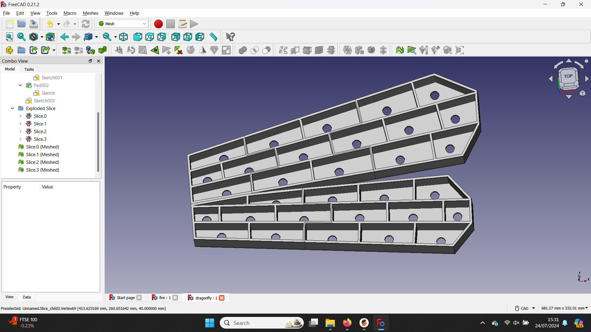

Here are some of Ben Everard's past projects

# Geometric nature experiments (2024)
Ben is experimenting with creating medium to large scale light art based around geometric representations of natural forms and proceedurally generated animations based on environmental stimuli.

<iframe width="560" height="315" src="https://www.youtube.com/embed/C1fCOHVTSrI" title="YouTube video player" frameborder="0" allow="accelerometer; autoplay; clipboard-write; encrypted-media; gyroscope; picture-in-picture; web-share" referrerpolicy="strict-origin-when-cross-origin" allowfullscreen></iframe>
**This geometric butterfly is the first prototype from a larger piece that is in development**

**As well as a butterfly, ben is developing other insects including a demselfly**

# Islamic art (colaboration with Riaz Shafti) (2022 - 2023)
Ben colaborated with Islamic artist Riaz Shafti on some pieces of illuminated geometric art.

**Ben and Riaz's art on display in North Street Gallery**
<iframe width="560" height="315" src="https://www.youtube.com/embed/DofvFemncmA" title="YouTube video player" frameborder="0" allow="accelerometer; autoplay; clipboard-write; encrypted-media; gyroscope; picture-in-picture; web-share" referrerpolicy="strict-origin-when-cross-origin" allowfullscreen></iframe>
**A test piece for the Islamic geometric art project running sample patterns**

# Recycling 3D printer waste (2022 -> present)
3D printers can churn through a lot of plastic. Typically, this is PLA which is not easily recycled using commercial recycling.

Ben has been experimenting with small-scape PLA recycling to create jewelry, clocks and other objects. 3D printer filament is often highly coloured, and when melted, different colours can be swirled together to create marbling effects unachievable by other means.

**Earings made from recycled blue and white plastic**

**Laser cuttable sheets made from 3D printer waste**

# PCBs as a creative medium (2021 -> 2023)
Printed Circuit Boards are usually rectanglar and locked away behind enclosers so users rarely get to see them. However, they can be manufactured in almost any shape, and in a range of colours. Ben has been experimenting with bare PCBs as Christmas decorations. The highly reflective solder pads can work particularly well with LED illumination.
<iframe width="315" height="560" 
src="https://www.youtube.com/embed/97T4aNBKajI" 
title="YouTube video player" frameborder="0" 
allow="accelerometer; autoplay; clipboard-write; encrypted-media;
gyroscope; picture-in-picture;
web-share"
allowfullscreen></iframe>
**A Christmas decoration designed to show off the bare PCB**
<iframe width="560" height="315" src="https://www.youtube.com/embed/NheTqymMw2s?si=9pHNAROECreSW9s9" title="YouTube video player" frameborder="0" allow="accelerometer; autoplay; clipboard-write; encrypted-media; gyroscope; picture-in-picture; web-share" referrerpolicy="strict-origin-when-cross-origin" allowfullscreen></iframe>
**This PCB uses large amounts of exposed metal to reflect the light**

# Freeform LED circuits (2021)
Typically, circuits are made on PCB or breadboard. However, anything that carries current can be used. Ben experimented with attaching addressable LEDs to brass frames to create circuits.
<iframe width="315" height="560" 
src="https://www.youtube.com/embed/CU4xKjgQPyo" 
title="YouTube video player" frameborder="0" 
allow="accelerometer; autoplay; clipboard-write; encrypted-media;
gyroscope; picture-in-picture;
web-share"
allowfullscreen></iframe>
**A free-form seven segment display**

# LED Clock (2019)
This LED word clock was Ben's first foray into using LEDs as a creative medium.

**This clock has been happily running for five years**

# User interaction (2021 - 2022)
We interact with computers in a very limited number of ways. Typically, keyboard, mouse and gamepad. However, there are many more sensors that can be used to take input from a user. Ben experimented by building a series of alternative computer controllers.
<iframe width="315" height="560" 
src="https://www.youtube.com/embed/HdFMW8ZR8MQ" 
title="YouTube video player" frameborder="0" 
allow="accelerometer; autoplay; clipboard-write; encrypted-media;
gyroscope; picture-in-picture;
web-share"
allowfullscreen></iframe>
**Scroll wheels are surprisingly versatile as input devices**
<iframe width="560" height="315" src="https://www.youtube.com/embed/P0G-hcmtkKg?si=Hs-5ErKOh6YvIMjc" title="YouTube video player" frameborder="0" allow="accelerometer; autoplay; clipboard-write; encrypted-media; gyroscope; picture-in-picture; web-share" referrerpolicy="strict-origin-when-cross-origin" allowfullscreen></iframe>
**Combining tilt and slide controls to drive a game vehicle**
<iframe width="560" height="315" src="https://www.youtube.com/embed/N-rmAXnfOWU?si=AHRg6oe0yxPYWj_9" title="YouTube video player" frameborder="0" allow="accelerometer; autoplay; clipboard-write; encrypted-media; gyroscope; picture-in-picture; web-share" referrerpolicy="strict-origin-when-cross-origin" allowfullscreen></iframe>
**The classic Frogger game, but you have to flap the book to make the frog jump**
<iframe width="560" height="315" src="https://www.youtube.com/embed/-YvIQ6jFTC0?si=37kOA0_71IqodKer" title="YouTube video player" frameborder="0" allow="accelerometer; autoplay; clipboard-write; encrypted-media; gyroscope; picture-in-picture; web-share" referrerpolicy="strict-origin-when-cross-origin" allowfullscreen></iframe>
**The first controller used a simple ultra sonic distance sensor to move a Pong paddle**
